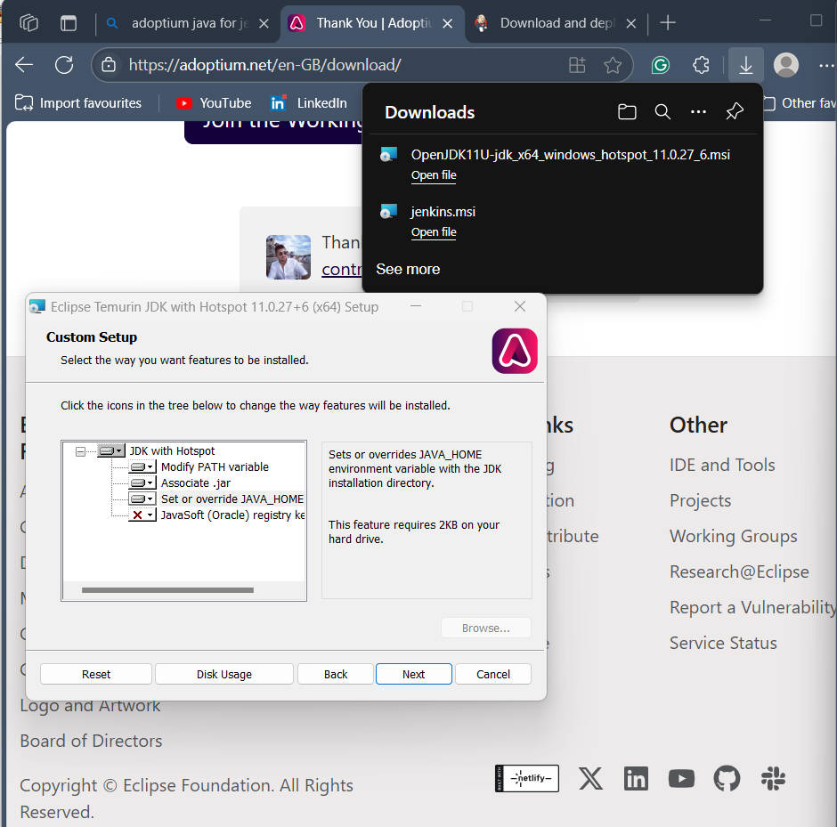

# Jenkins

## Introduction

Continuous Integration and Continuous Deployment (CI/CD) are essential practices in modern software development. CI/CD automates the process of integrating code changes, running tests, and deploying applications, ensuring faster and more reliable software delivery. Jenkins is a popular open-source automation server that enables developers to implement CI/CD pipelines efficiently. With Jenkins, teams can automate building, testing, and deploying their applications, improving productivity and reducing manual errors.

## Setting up Jenkins

This guide walks you through the process of setting up Jenkins on your system. The following images illustrate each step of the installation and initial configuration process.

  
**Step 1: Java Installation**  
Jenkins requires Java to run. This image shows the installation of Java, which is a prerequisite for Jenkins.

  
**Step 2: Verifying Java Installation**  
After installing Java, it's important to verify the installation. This screenshot confirms that Java is correctly installed and available on the system.

  
**Step 3: System Update**  
Before installing Jenkins, the system packages are updated to ensure all dependencies are up to date.

  
**Step 4: Installing Jenkins**  
This image shows the process of installing Jenkins using the package manager.

  
**Step 5: Jenkins Installation Progress**  
Here, Jenkins is being installed. The progress of the installation is displayed in the terminal.

  
**Step 6: Checking Jenkins Status**  
After installation, it's important to check the status of the Jenkins service to ensure it is running properly.

  
**Step 7: Security Group Configuration**  
This screenshot shows the configuration of security groups or firewall rules to allow access to Jenkins from your browser.

  
**Step 8: Unlocking Jenkins**  
When you access Jenkins for the first time, you need to unlock it using a password generated during installation. This image shows the unlock screen.

  
**Step 9: Installing Plugins**  
Jenkins supports a wide range of plugins. This step involves installing recommended plugins to extend Jenkins' functionality.

  
**Step 10: Creating the First Admin User**  
After plugins are installed, you are prompted to create the first admin user for Jenkins.

  
**Step 11: Jenkins is Ready**  
This image confirms that Jenkins is successfully set up and ready to use.

  
**Step 12: Jenkins Dashboard**  
Finally, you are taken to the Jenkins dashboard, where you can start creating and managing your CI/CD pipelines.

  
**Step 13: Creating a New Jenkins Job**  
This image shows the process of creating a new job in Jenkins. Click on "New Item" to start configuring a new project or pipeline.

  
**Step 14: Selecting Freestyle Project**  
Here, you select "Freestyle project" as the type of job. Freestyle projects are flexible and allow you to configure simple or complex build steps.

  
**Step 15: Connecting to GitHub**  
This step demonstrates how to connect your Jenkins job to a GitHub repository. Enter the repository URL so Jenkins can pull your code for building and testing.

  
**Step 16: Configuring Build Steps**  
In this image, you configure the build steps for your project. This could include compiling code, running tests, or any other build actions required for your application.

  
**Step 17: Setting Build Triggers**  
Here, you set up build triggers, such as polling the repository or using webhooks, so Jenkins knows when to start a new build automatically.

  
**Step 18: Configuring GitHub Webhook**  
This image shows the configuration of a webhook in GitHub. The webhook notifies Jenkins whenever there is a new commit, triggering an automated build.

  
**Step 19: Reviewing Job Configuration**  
Before saving, review all your job configurations to ensure everything is set up correctly, including source control, build steps, and triggers.

  
**Step 20: Build Pipeline Complete**  
This final image confirms that your Jenkins job is set up and has run successfully. You can now see the build history and results on the dashboard.

  
**Step 21: Testing the Pipeline**  
This screenshot shows the process of running a test build in Jenkins. Here, you can observe the build being triggered, which helps verify that your configuration and triggers are working as expected.

  
**Step 22: Build Results**  
This image displays the results of the build process. Jenkins provides detailed feedback, including logs and status indicators, so you can quickly identify if the build was successful or if there were any issues.

  
**Step 23: GitHub Integration Results**  
This screenshot demonstrates the integration between Jenkins and GitHub. It shows how build statuses and results are reflected back in your GitHub repository, providing visibility into the CI/CD process directly from your version control platform.

## Conclusion

By following these steps, you have successfully installed and configured Jenkins, created and tested a CI/CD pipeline, and integrated it with GitHub for automated builds and feedback. The images and explanations above guide you through each stage, from initial setup to verifying build results and GitHub integration. Jenkins streamlines the software development process, enabling teams to deliver high-quality applications faster and more reliably. Continue exploring Jenkins to leverage its full automation capabilities and further enhance your CI/CD workflows.

